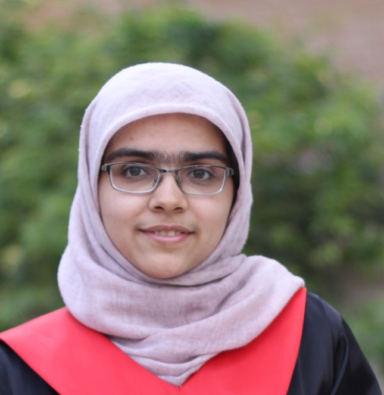



# About This Course

Natural Language Processing (NLP) is one of the main subfields of Artificial Intelligence (AI) which deals with understanding and generating human language (often in text form). Similarly to most other applied areas of AI, NLP has undergone a rapid change over the past decade with advancements in the area of machine (deep) learning. This course provides an overview of some of the most recent developments in the area of NLP, mostly with deep learning flavor.

   
 
 
            
  

   <h1>
    Course instructor
   </h1>
   

    

     
     
Mohammad Taher Pilehvar

    

   

  

 

 
  
 
 
        
 
  

   <h1>
    Teaching Assistants
   </h1>
   

    

     
     
Zahra Delbari

    

    

     
     
Mahdi Zakizadeh

    

   

   

   

   
       
 

